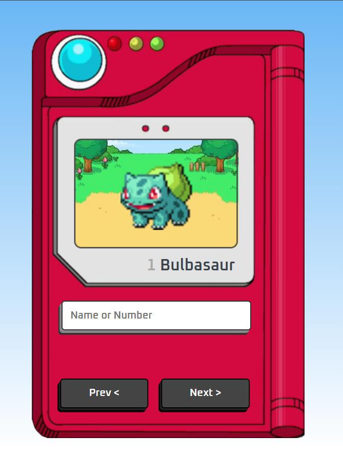

# Pokédex com HTML, CSS e JavaScript

Este é um projeto de uma Pokédex, desenvolvido com HTML, CSS e JavaScript seguindo as instruções do vídeo do canal [Manual do Dev](https://www.youtube.com/@manualdodev).

O objetivo deste projeto é aprender e praticar as linguagens HTML, CSS e JavaScript por meio da criação de uma Pokédex funcional e visualmente atrativa.

## Funcionalidades

- Exibe uma lista de Pokémons com imagens, nomes e números.
- Permite navegar entre as páginas de Pokémons.
- Utiliza a PokéAPI (https://pokeapi.co/) para buscar dados dinâmicos sobre os Pokémons.

## Tecnologias Utilizadas

- **HTML:** Estrutura do projeto.
- **CSS:** Estilização da interface.
- **JavaScript:** Lógica e interatividade, incluindo requisições à API.

## Como Rodar o Projeto

1. **Clone o repositório:**
   ```bash
   git clone https://github.com/Miniki7/Pokedex-.git
   ```

2. **Acesse o diretório do projeto:**
   ```bash
   cd Pokedex-
   ```

3. **Abra o arquivo `index.html` em seu navegador.**
   - Não é necessário servidor local para este projeto, pois é um projeto estático.

## Estrutura do Projeto

- **`index.html`**: Contém a estrutura base da Pokédex.
- **`style.css`**: Estilos utilizados para deixar a Pokédex visualmente atrativa.
- **`script.js`**: Lógica e integração com a PokéAPI para buscar dados dinâmicos.

## Aprendizados

Durante o desenvolvimento deste projeto, foram abordados conceitos importantes, como:

- Manipulação do DOM com JavaScript.
- Requisições HTTP utilizando `fetch()`.
- Estruturação de uma página responsiva com CSS.
- Organização de arquivos e integração com a PokéAPI.

## Referências

- [Manual do Dev no YouTube](https://www.youtube.com/@manualdodev)
- [Repositório oficial do Manual do Dev no GitHub](https://github.com/manualdodev/pokedex)
- [PokéAPI](https://pokeapi.co/): API utilizada para obter informações sobre Pokémons.

## Screenshots

<p align="center">
  
</p>

## Licença

Este projeto é livre para uso e distribuído sob a [Licença MIT](https://opensource.org/licenses/MIT).

